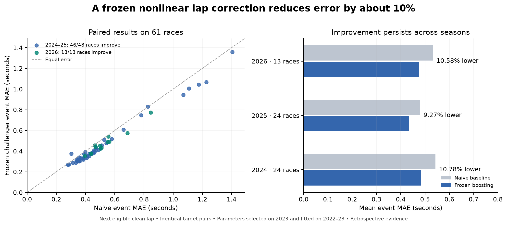

**A substantial live F1 forecasting gain — 7 September 2026**

The selected frozen challenger reduces next-eligible-lap error by **10.07% across 2024–2025** and **10.58% across all 13 available 2026 races**. It improves 59 of the 61 evaluation races. Against the previous research ridge, its reduction is 7.55% historically and 9.57% in 2026. This meets the research gate defined before the sweep. It is a usable research model with an observed-prefix inference interface; production defaults and maturity records remain unchanged.

The winning method is histogram gradient boosting trained on an absolute-error residual objective, using causal lap, sector, speed and peer history. A neural residual model and Extra Trees also produce substantially larger gains than the earlier linear correction. The stronger results therefore extend beyond a single selected tree configuration, although the preferred model remains the one chosen using 2023 alone.

| Evaluation period | Races / matched forecasts | Naive MAE, seconds | Challenger MAE, seconds | Reduction | Races improved |
|---|---:|---:|---:|---:|---:|
| 2024 | 24 / 22,171 | 0.542564 | 0.484093 | 10.7769% | 24/24 |
| 2025 | 24 / 21,663 | 0.478428 | 0.434086 | 9.2684% | 22/24 |
| **2024–2025 pooled** | **48 / 43,834** | **0.510496** | **0.459089** | **10.0700%** | **46/48** |
| **2026, R1–R13** | **13 / 11,923** | **0.531827** | **0.475542** | **10.5833%** | **13/13** |
| 2026 newest four races, R10–R13 | 4 / 3,779 | 0.492773 | 0.439099 | 10.8921% | 4/4 |

Rows containing pooled periods overlap their component rows. They must not be counted as independent repetitions. F1 error is averaged within race and then equally across races. The baseline and challenger use exactly the same issuance/target identities, with no outcome-based exclusion of difficult forecasts.

The historical candidate-minus-naive delta is **−51.407 ms**, with three-event circular-block bootstrap 95% interval **[−60.812, −41.243] ms**. The corresponding 2026 delta is **−56.285 ms**, interval **[−69.948, −43.383] ms**. Every leave-one-event-out average remains improving in both periods. The newest four races have delta −53.673 ms and event-bootstrap interval [−74.015, −25.071] ms; four races still provide limited evidence about future event distributions. These intervals describe conditional historical variability, not posterior probabilities, proof of a 10% minimum future gain, or correction for previous research exposure.

**The experiment was selected before transfer scoring.** The original specification defined a substantial result as at least 10% lower historical event MAE than naive, at least 7% lower than the previous ridge, improvement in each historical year, a negative upper block-bootstrap bound, improvement under every leave-one-event-out deletion, and a positive 2026 point gain. All six conditions pass. The historical point reduction clears 10% narrowly; its confidence interval does not imply the true reduction must exceed 10%.

The sweep compared **36 candidates across five families**: multiscale filters; causal online expert weighting; six absolute-error boosting configurations; two Extra Trees configurations; and a neural residual model. Learned models also had fixed half-correction shrinkage alternatives. Models were fitted on 2022 and selected on 2023. The preferred model and family comparators were then refitted once on 2022–2023 and frozen before transfer scoring. This uses 38,370 discovery-period matched rows; evaluation uses another 55,757 rows. No 2024–2026 label was used to fit or select the frozen models.

| Family winner selected on 2023 | 2024–2025 reduction | 2026 reduction |
|---|---:|---:|
| Absolute-error histogram boosting | 10.0700% | 10.5833% |
| Extra Trees | 8.9897% | 10.4873% |
| Neural residual model | 8.6838% | 9.8321% |
| Online expert weighting | 1.5225% | 4.3531% |
| Reset EWMA | 0.9613% | 2.7705% |
| Previous frozen ridge, reference | 2.7261% | 1.1212% |

The neural model uses two 64-unit SiLU hidden layers plus a linear input-to-output skip, event-weighted absolute loss, 30 fixed epochs and a fixed seed. It is a tested nonlinear competitor, not a transformer or pretrained foundation model. Primary tabular-learning research motivates comparing strong tree and neural models under the same protocol; it does not identify a universally superior architecture. [Gorishniy et al., 2021](https://proceedings.neurips.cc/paper_files/paper/2021/hash/9d86d83f925f2149e9edb0ac3b49229c-Abstract.html).

**The mathematical change is conditional residual prediction.** At issuance, let y be the latest eligible completed lap and x the observations available then. The forecast is y + clip(f(x), −3, +3) seconds. Boosting fits the residual clip(next eligible lap − y, −5, +5), using weighted absolute loss. A row from event e receives weight N/(E n_e), where N is the training-row count, E is the number of training events, and n_e is that event's row count. Each event therefore has equal total training weight. The selected configuration has 150 iterations, 15 leaves, learning rate 0.06, minimum leaf size 80, L2 regularization 10, and no random early stopping.

Absolute loss favors a conditional median; the prior ridge fitted a clipped conditional mean under squared loss. The new learner can also use nonlinear interactions between recent pace differences, trend, observation support and current conditions. Training and prediction clipping deliberately constrain the correction. This is an empirical improvement, not a claim of Bayes-optimal estimation of the unmodified target distribution.

The 80 features include the prior nine causal inputs; last six same-stint lap differences and their lap distances; mean, median, trend and dispersion across several history lengths; observed sector times and speed traps; current lap, compound, tyre state and position; and strictly earlier other-driver observations. Features use no next-lap identity, future stint indicator, eventual race distance, current target or full-race pace filter. Same-timestamp peers cannot influence one another.

**A source-export omission was found and repaired without changing the model.** The first transfer run passed the historical gain threshold but failed badly on the newest four races. Those four CSVs had originally been exported for the earlier nine-feature model and omitted all sector, speed, position and fresh-tyre fields. The experimental encoder treated those absent fields as missing values. That produced an invalid comparison for the richer input contract: recent boosting MAE rose to about 1.061 seconds.

The complete observed fields already existed in the original FastF1 cache. An offline recovery restored nine omitted columns into separate files, converting native timing values explicitly to seconds. Every original column, lap identity, observed target time and row count was retained. Cache payload hashes, original export hashes, fitted-model bytes and the selection lock were checked before and after. **There was no new model fitting, parameter adjustment or winner selection.** The corrected replay is canonical; the failed replay remains recorded. The inference interface now rejects incomplete observed schemas and supports prefixes whose next target has not happened yet.

This correction was diagnosed after seeing a failure, so the final evidence is an **amended retrospective evaluation**. The 2024–2026 dates had already been exposed in earlier work. They are not relabeled as pristine holdouts or prospective forecasts. Recorded lap fields are assumed available on receipt; historical cache files do not establish original vendor latency or rule out later revisions.

**Attribution narrows the mechanism.** Fixed-hyperparameter ablations were run after discovery, solely to explain the gain. They do not change the selected model:

| Diagnostic variant | 2024–2025 reduction | 2026 reduction |
|---|---:|---:|
| Boosting with only the previous nine features | 8.2710% | 10.2672% |
| Full model without sector/speed features | 10.5107% | 10.2659% |
| Full model without the additional peer features | 8.6325% | 11.5523% |

Changing the learner and loss accounts for much of the gain even without adding inputs. Sector/speed fields do not show a consistent incremental benefit, and the additional peer features help the older period while slightly hurting 2026. This joint comparison does not isolate the separate causal contributions of nonlinearity, absolute loss and regularization. Selecting a different model from these post-discovery numbers would require a new protocol and new evaluation evidence.

The two historical losses are Belgium 2025, approximately +2.7 ms, and Las Vegas 2025, approximately +73.2 ms. The model improves both same-stint and cross-stint matched targets in pooled row-weighted diagnostics: 0.453805 → 0.403641 seconds over 53,958 same-stint rows, and 2.092196 → 1.943088 seconds over 1,799 cross-stint rows. Those diagnostics use different weighting from the primary event metric and depend on target-side stint labels; they are explanations, not inference inputs or newly selected populations.

**RL was assessed against the actual data contract.** The current strategy audit contains 9,506 transitions but zero exact observed-action rows, zero usable offline-Q rows and zero propensity-based policy-evaluation rows under its existing action/state contract. Training an impressive-looking RL policy against an assumed simulator would therefore not establish a real strategy improvement. Offline RL needs credible support for evaluating actions under distribution shift. [Levine et al., 2020](https://arxiv.org/abs/2005.01643).

The online expert policy tested here is a full-information forecasting policy: after an outcome arrives, the losses of all issued expert forecasts are observable. It updates only then, using exponentially weighted past losses and a fixed forgetting factor. It is not a claim of improved pit-stop decisions. The broader literature on shifting-expert aggregation motivates adaptation, but the implemented simple policy is not a reproduction of AdaHedge or its regret guarantees. [V'yugin, 2017](https://proceedings.mlr.press/v60/v-yugin17a.html).

**Verification and usable artifacts.** Ten focused tests pass. The verifier checks 105 source-file hashes, reconstructs the preferred 2023 selection fit, reproduces serialized learned predictions, recomputes 30 metric/interval pairs, and runs six real-stream truncation/future-poisoning cases. All 55,757 transfer targets match the published baseline population exactly. The exported inference encoder additionally matches the frozen experimental features and predictions on three real events, with maximum forecast difference zero. Its output contains issuances and forecasts, without future target columns.

The [research guide](../../research/experiments/frontier_20260907/README.md) contains commands and canonical paths. The [78-row scorecard](evidence/frontier_live_performance_20260907_scorecard.csv) records all selection candidates, family transfers and diagnostic ablations. The [summary and hashes](evidence/frontier_live_performance_20260907_summary.json) bind the result files and model bundle. The canonical result SHA256 is `c9c230e889f178413e6d9f841cb2456d8a39b7e6e59b4ae3bf6d4092ba2da097`; the exported model SHA256 is `8845658bc0e37c9cc2d4878d846b643d1449efb342469ff509c3c6ec41ab484c`.

The concrete result is a stronger live next-eligible-lap point predictor. It does not establish calibrated uncertainty, immediate next-numbered-lap performance, better race rankings, football improvement, or strategy value. The next operational step is to collect predictions from this exact frozen challenger alongside the baseline before subsequent races unfold, using the enforced input contract. That is future validation work; no automation, deployment or production promotion was performed here.

Suggested commit: `research(f1-live): add verified nonlinear forecasting challenger`.
